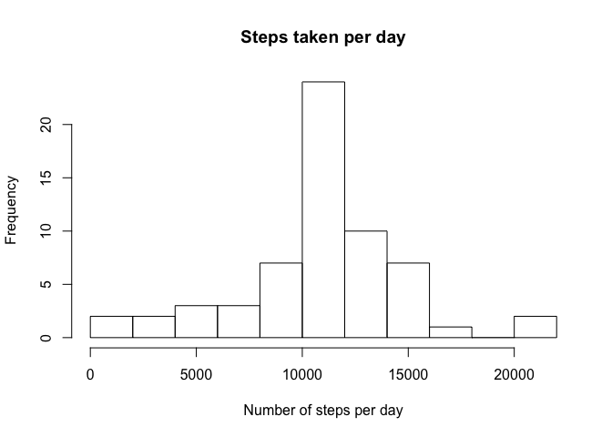

# Reproducible Research: Peer Assessment 1

Import all required libraries first
Set echo=TRUE for all code blocks

```r
library(knitr)
suppressMessages(library(dplyr))
library(lubridate)
library(ggplot2)
opts_chunk$set(echo=TRUE)
```


## Loading and preprocessing the data

### Getting the Data
The data is already contained in the forked github repository
https://github.com/rdpeng/RepData_PeerAssessment1

It could be downloaded from https://d396qusza40orc.cloudfront.net/repdata%2Fdata%2Factivity.zip.

#### Extract the data set:

```r
if (!file.exists("activity.csv")) {
  unzip("activity.zip")
}
```

The variables in this data set are:

- steps: Number of steps taking in a 5-minute interval
- date: The data of the measurement in format **YYYY-MM-DD**
- interval: identifier for the 5-minute-interval

There are 17568 observations

### Read the CSV data
I avoid converting the dates into factors because I'll parse them with lubridate.

```r
activity <- read.csv("activity.csv", stringsAsFactors=F)
```

### Process/Transform the data

#### Cleaning the data
Convert the dates to POSIXct objects with lubridate `ymd`.

```r
activity <- tbl_df(activity) %>%
  mutate(date = ymd(date))
```

#### Calculate the total number of steps taken per day
Dplyr makes this an easy task.

```r
activity.summary <- activity %>%
  group_by(date) %>%
  summarize(total_steps = sum(steps, na.rm = TRUE))

activity.summary
```

```
## Source: local data frame [61 x 2]
## 
##          date total_steps
## 1  2012-10-01           0
## 2  2012-10-02         126
## 3  2012-10-03       11352
## 4  2012-10-04       12116
## 5  2012-10-05       13294
## 6  2012-10-06       15420
## 7  2012-10-07       11015
## 8  2012-10-08           0
## 9  2012-10-09       12811
## 10 2012-10-10        9900
## ..        ...         ...
```

## What is mean total number of steps taken per day?
Histogram of the total number of steps taken per day

```r
hist(activity.summary$total_steps, 
     breaks = 10,
     xlab = "Number of steps per day", 
     main =  "Steps taken per day")
```

 

The mean number of steps taken per day is:

```r
total_steps.mean <- mean(activity.summary$total_steps)
total_steps.mean
```

```
## [1] 9354.23
```

The median number of steps taken per day is:

```r
total_steps.median <- median(activity.summary$total_steps)
total_steps.median
```

```
## [1] 10395
```

## What is the average daily activity pattern?

Time series plot of the 5-minute interval average across all days

```r
activity.by_interval <- activity %>%
  group_by(interval) %>%
  summarize(avg_steps = mean(steps, na.rm = TRUE))
  
plot(type="l", x = activity.by_interval$interval, y = activity.by_interval$avg_steps,
     main = "Daily activity pattern",
     xlab = "5-minute interval", ylab = "average number of steps")
```

 

Find the maximum interval

```r
steps.max <- with(activity.by_interval, interval[which.max(avg_steps)])
```

The 5-minute interval with the highest average is 835.

## Imputing missing values

Number of missing values in the dataset:

```r
sum(is.na(activity$steps))
```

```
## [1] 2304
```

Strategy for filling the missing values:
Mean for the 5-minute interval over all days

Create a new imputed dataset with the impute strategy applied.

```r
impute_strategy <- function(steps, interval) {
  ## for NAs gets the average of the interval across all days
  
  ## number of days
  n <- length(unique(activity$date)) 
  
  # replicate the average for each day
  # so it's easier to replace with ifelse
  interval.avg <- rep(activity.by_interval$avg_steps, n)
  
  ifelse(is.na(steps), interval.avg, steps)
}

activity.imputed <-
  activity %>%
  mutate(steps = impute_strategy(steps, interval))

sum(!complete.cases(activity.imputed))
```

```
## [1] 0
```

Histogram of the total number of steps taken each day
with the imputed dataset:

```r
activity.imputed.summary <- activity.imputed %>%
  group_by(date) %>%
  summarize(total_steps = sum(steps))
activity.imputed.summary
```

```
## Source: local data frame [61 x 2]
## 
##          date total_steps
## 1  2012-10-01    10766.19
## 2  2012-10-02      126.00
## 3  2012-10-03    11352.00
## 4  2012-10-04    12116.00
## 5  2012-10-05    13294.00
## 6  2012-10-06    15420.00
## 7  2012-10-07    11015.00
## 8  2012-10-08    10766.19
## 9  2012-10-09    12811.00
## 10 2012-10-10     9900.00
## ..        ...         ...
```

```r
hist(activity.imputed.summary$total_steps, 
     breaks = 10,
     xlab = "Number of steps per day", 
     main =  "Steps taken per day")
```

 

The mean number of steps taken per day is:

```r
mean(activity.imputed.summary$total_steps)
```

```
## [1] 10766.19
```

Compared to the dataset with missing values removed:

```r
impact.mean <- round(1 - mean(total_steps.mean/activity.imputed.summary$total_steps), 2)
```
The impact of replacing the missing values on the mean is -4.9 %.


The median number of steps taken per day is:

```r
median(activity.imputed.summary$total_steps)
```

```
## [1] 10766.19
```

Compared to the dataset with missing values removed:

```r
impact.median <- round(1 - median(total_steps.median/activity.imputed.summary$total_steps), 2)
```
The impact of replacing the missing values on the median is 0.03 %.

## Are there differences in activity patterns between weekdays and weekends?

new factor variable weekend

```r
activity.imputed$weekend <- ifelse(wday(activity.imputed$date) %in% c(2:5), 1, 0)
activity.imputed$weekend <- factor(activity.imputed$weekend, labels = c("Weekend", "Weekday"))
```

Time series plot

```r
activity.by_weekend <- activity.imputed %>%
  group_by(weekend, interval) %>%
  summarize(avg_steps = mean(steps))

qplot(interval, avg_steps, data=activity.by_weekend, facets = weekend ~ ., geom = "line") + ylab("Average Steps") + xlab("5-minute interval")
```

 
